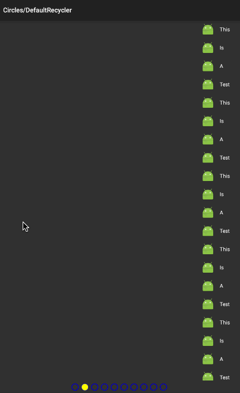
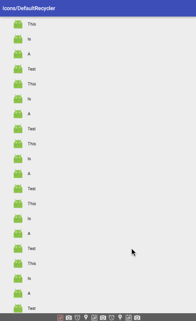
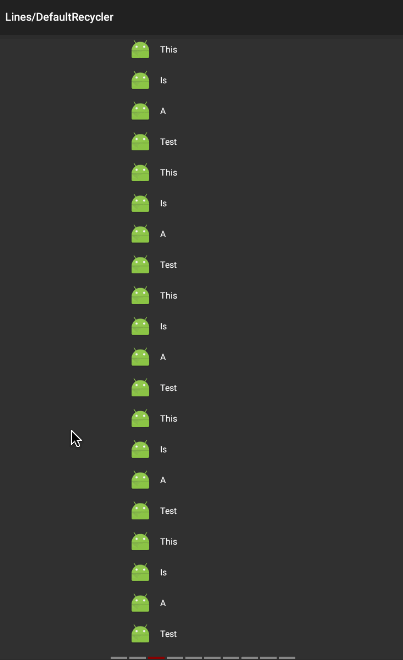
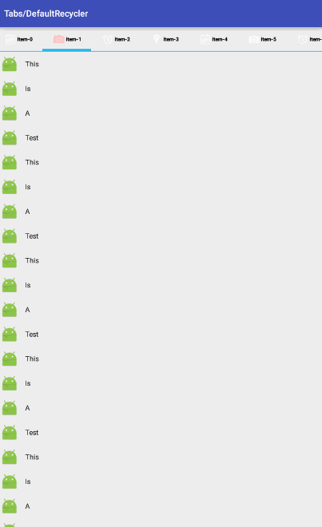
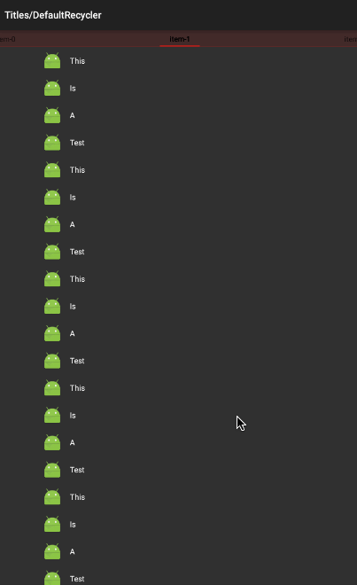
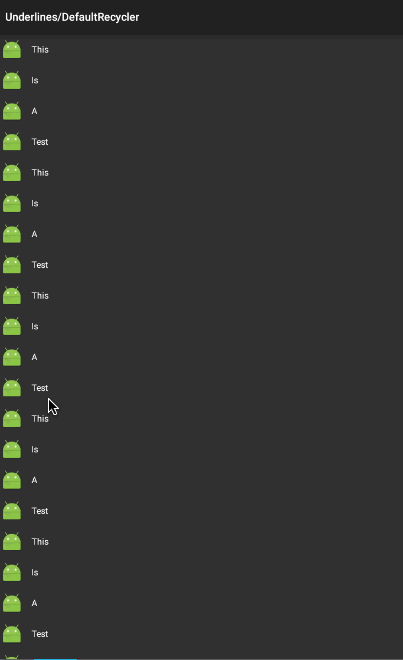

# RecyclerViewPagerIndicator
类似于ViewPagerIndicator，用RecyclerView来实现ViewPager，并加上Indicator

大致分为六个部分：

1.Circle 圆圈提示器

 
 
2.Icon 图标提示器

 

3.Line 线段提示器

 

4.Tab 标签提示器

 

5.Title 标题提示器

 

6.Underline 下划线提示器

 

借鉴了两个开源项目

https://github.com/JakeWharton/ViewPagerIndicator

https://github.com/lsjwzh/RecyclerViewPager

对两位作者表示深切的感谢～

使用方法：
详见代码

如何引入：
暂时先引入代码，如果此项目很受欢迎的话，我会做源。

