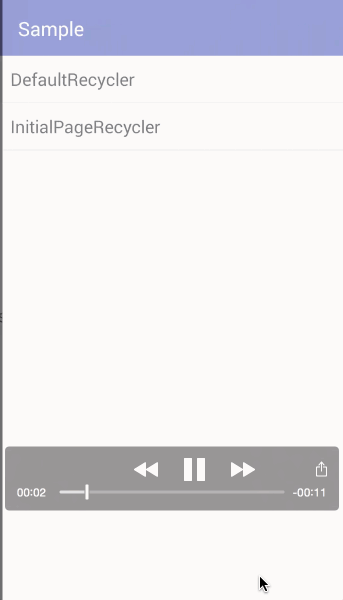
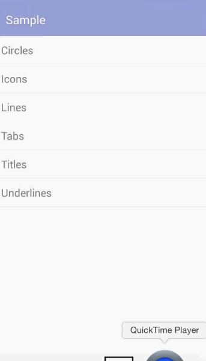
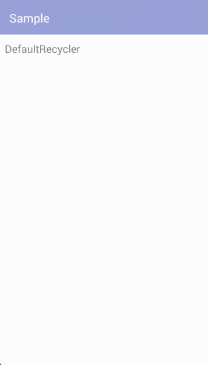
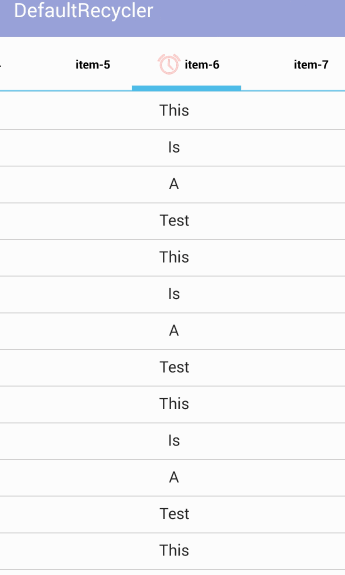
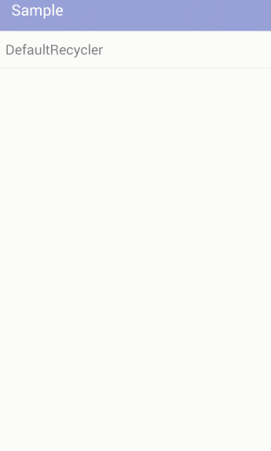
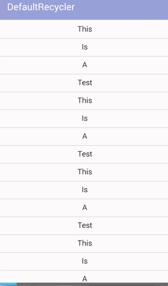

# RecyclerViewPagerIndicator
类似于ViewPagerIndicator，用RecyclerView来实现ViewPager，并加上Indicator

大致分为六个部分：

1.Circle 圆圈提示器

 
 
2.Icon 图标提示器

 

3.Line 线段提示器

 

4.Tab 标签提示器

 

5.Title 标题提示器

 

6.Underline 下划线提示器

 

# Thanks
该工程项目修改及使用了以下项目： 
https://github.com/JakeWharton/ViewPagerIndicator 
https://github.com/lsjwzh/RecyclerViewPager 
https://github.com/blipinsk/RecyclerViewHeader 
对三位作者表示深切的感谢～

# 使用方法
Gradle usage：
> 
        dependencies {
                compile 'com.buyi.recyclerviewpagerindicator:recycler-viewpager-indicator:1.1'
        }

Circle 圆圈提示器：
> 
        FragmentsAdapter adapter = new FragmentsAdapter(getSupportFragmentManager());
        pager.setAdapter(adapter);
   
> 
        LinearLayoutManager manager = new LinearLayoutManager(this);
        manager.setOrientation (LinearLayoutManager.HORIZONTAL);
        pager.setLayoutManager(manager);
                                   
> 
        indicator.setViewPager(pager);
        indicator.setFillColor(Color.parseColor("#FF33B5E5"));

Icon 图标提示器
> 
        // config adapter
        FragmentsAdapter adapter = new FragmentsAdapter(getSupportFragmentManager());
        pager.setAdapter(adapter);

> 
        // config layoutmanager
        LinearLayoutManager manager = new LinearLayoutManager(this);
        manager.setOrientation (LinearLayoutManager.HORIZONTAL);
        pager.setLayoutManager(manager);
> 
        // config indicator
        indicator.setViewPager(pager);     
        
  

Line 线段提示器
> 
        FragmentsAdapter adapter = new FragmentsAdapter(getSupportFragmentManager());
        pager.setAdapter(adapter);

> 
        LinearLayoutManager manager = new LinearLayoutManager(this);
        manager.setOrientation(LinearLayoutManager.HORIZONTAL);
        pager.setLayoutManager(manager);

>       
        indicator.setViewPager(pager);    
        
   
      
       
Tab 标签提示器
> 
        FragmentsAdapter adapter = new FragmentsAdapter(getSupportFragmentManager());
        pager.setAdapter(adapter);
        
> 
        LinearLayoutManager manager = new LinearLayoutManager(this);
        manager.setOrientation(LinearLayoutManager.HORIZONTAL);
        pager.setLayoutManager(manager);
        
>
        indicator.setViewPager(pager);
               
               
               
               
Title 标题提示器            
>                     
        FragmentsAdapter adapter = new FragmentsAdapter(getSupportFragmentManager());
        pager.setAdapter(adapter);
>              
        LinearLayoutManager manager = new LinearLayoutManager(this);
        manager.setOrientation (LinearLayoutManager.HORIZONTAL);
        pager.setLayoutManager(manager);
>                
        indicator.setViewPager(pager);
        indicator.setTextColor(Color.parseColor("#000000"));
        indicator.setSelectedColor (Color.parseColor("#FF33B5E5"));
                      
                      
                      
                      
Underline 下划线提示器

> 
        FragmentsAdapter adapter = new FragmentsAdapter(getSupportFragmentManager());
        pager.setAdapter(adapter);
>                        
        LinearLayoutManager manager = new LinearLayoutManager(this);
        manager.setOrientation (LinearLayoutManager.HORIZONTAL);
        pager.setLayoutManager(manager);
>                        
        indicator.setViewPager(pager);

详见代码

如何引入：
暂时先引入代码，如果此项目很受欢迎的话，我会做源。

# Contact

&nbsp;&nbsp;&nbsp;

